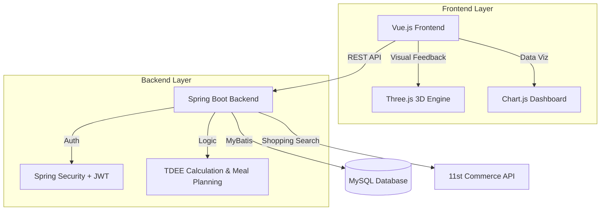

# 🥗 Diet Coach (다이어트 코치)

[](https://www.oracle.com/java/)
[](https://spring.io/projects/spring-boot)
[](https://vuejs.org/)
[](https://www.mysql.com/)
[](LICENSE)

> **AI & 3D Avatar Based Diet Management Solution**  
> 사용자의 신체 데이터를 분석하여 **TDEE(일일 총 에너지 소비량)**를 계산하고, 맞춤형 식단 및 쇼핑 가이드를 제공하는 헬스케어 플랫폼입니다. **체중 변화에 따라 실시간으로 진화하는 3D 캐릭터**를 통해 건강 관리의 동기를 부여합니다.

---

## 📅 프로젝트 개요

- **프로젝트명**: Diet Coach (다이어트 코치)
- **개발 기간**: 2025.12 ~ (진행 중)
- **주요 목표**:
  - 과학적인(TDEE 기반) 다이어트 목표 설정
  - 사용자 맞춤형 식단 자동 생성 알고리즘 구현
  - 게이미피케이션(3D 캐릭터) 요소를 통한 지속적인 사용자 참여 유도
  - 외부 커머스 API 연동을 통한 식재료 구매 편의성 제공

---

## 🏛 시스템 아키텍처 (System Architecture)



---

## 🚀 주요 기능 (Key Features)

### 1. 🥑 인터랙티브 3D 캐릭터 (Interactive Avatar)
- **Three.js** 기반의 3D 아바타(아보카도) 렌더링
- **동적 체형 변화**: 사용자의 BMI 변화에 따라 캐릭터가 **Level 1(매우 마름) ~ Level 5(비만)** 단계로 실시간 변화
- 시각적 피드백을 통한 강력한 동기 부여 제공

### 2. 📊 개인화된 건강 분석 & TDEE
- 신체 정보(성별, 나이, 키, 체중) 및 활동량(Activity Level) 기반 정밀 분석
- **BMR(기초대사량)** 및 **TDEE** 자동 계산
- 목표(감량/유지/증량)에 따른 **일일 권장 칼로리** 가이드

### 3. 🍽 스마트 식단 매니지먼트
- 알고리즘 기반 **1개월 식단 자동 생성**
- 끼니별(아침/점심/저녁) 메뉴 및 영양 정보(탄단지) 제공
- 섭취 기록(Stamp) 및 목표 달성률 트래킹

### 4. 🛒 식재료 쇼핑 연동
- 식단 기반 필요 식재료 자동 리스트업
- **Open API(11번가)** 연동을 통한 최저가 상품 검색 및 추천
- 장바구니 기능 제공

### 5. 📈 통합 대시보드
- 체중 변화 추이 그래프 (Chart.js)
- 일별/주별 칼로리 섭취량 분석
- 체중 기록 메모 및 히스토리 관리

---

## 🛠 기술 스택 (Tech Stack)

| Category | Technology | Description |
| --- | --- | --- |
| **Backend** | **Java 17** | Core Language |
| | **Spring Boot 3.5.8** | Web Framework |
| | **Spring Security** | Authentication & Authorization |
| | **JJWT (JWT)** | Token-based Security (Access/Refresh with Rotation) |
| | **MyBatis 3.0.5** | SQL Mapper Framework |
| | **MySQL 8.0** | RDBMS |
| **Frontend** | **Vue.js 3.5.24** | Progressive JavaScript Framework |
| | **Vite** | Frontend Build Tool |
| | **Three.js** | 3D Graphics Library |
| | **Chart.js** | Data Visualization |
| | **Axios** | HTTP Client |
| **DevOps** | **Maven** | Dependency Management |
| | **Git** | Version Control |

---

## 📂 프로젝트 구조 (Directory Structure)

```bash
diet_coach_PJ
├── backend                     # Spring Boot Application
│   ├── src/main/java           # Java Source Code
│   ├── src/main/resources      # Resources & SQL
│   └── pom.xml                 # Maven Dependencies
├── frontend                    # Vue.js Client
│   ├── src                     # Vue Source Code
│   └── package.json            # Node.js Dependencies
└── README.md
```

---

## ⚙️ 설치 및 실행 가이드 (Installation)

### 1. Prerequisites
- **Java JDK 17+**
- **Node.js 18+**
- **MySQL 8.0+**

### 2. Database Setup
MySQL 데이터베이스를 생성하고 초기 스키마를 적용합니다.

```sql
CREATE DATABASE yumyum;
USE yumyum;
-- backend/src/main/resources/schema/schema.sql 파일의 내용을 실행하여 테이블 생성
```

### 3. Environment Variables
본 프로젝트는 보안을 위해 API 키 및 비밀 정보를 환경 변수로 관리합니다.

1. 프로젝트 루트의 `.env.example` 파일을 참고하여 필요한 환경 변수 목록을 확인합니다.
2. 개발 환경(Local)에 맞게 시스템 환경 변수를 설정하거나, IDE(IntelliJ 등)의 실행 환경 설정에 변수를 등록합니다.
3. 주요 필요 변수: `GMS_API_KEY`, `JWT_SECRET`, `ELEVENST_API_KEY`, `NAVER_CLIENT_ID` 등

### 4. Backend Configuration
`backend/src/main/resources/application.yml` 파일에서 기본 설정을 확인합니다. (비밀 키는 환경 변수를 통해 주입됩니다.)

### 5. Run Backend
```bash
cd backend
./mvnw clean install
./mvnw spring-boot:run
```

### 6. Run Frontend
```bash
cd frontend
npm install
npm run dev
```

---

## 🔒 보안 (Security Implementation)

본 프로젝트는 **JWT (JSON Web Token)** 기반의 인증 시스템을 구축하였습니다.

- **Access Token**: API 접근 권한 인증 (유효기간 짧음)
- **Refresh Token**: Access Token 재발급 용도 (DB 저장, 보안 강화)
- **RTR (Refresh Token Rotation)**: Refresh Token 사용 시 기존 토큰을 폐기하고 새로운 토큰을 발급하여 탈취 위험을 최소화하는 **Rotation** 정책을 적용했습니다.

---

## 🤝 Contributing

1. 이 저장소를 **Fork** 합니다.
2. 새로운 브랜치를 생성합니다. (`git checkout -b feature/NewFeature`)
3. 변경사항을 **Commit** 합니다. (`git commit -m 'Add NewFeature'`)
4. 브랜치에 **Push** 합니다. (`git push origin feature/NewFeature`)
5. **Pull Request**를 요청합니다.

---

## 📝 License

This project is licensed under the MIT License - see the [LICENSE](LICENSE) file for details.

---

### 📞 Contact
- **Team**: ImChanHyuck 
- **Email**: dlacksgur311@gmail.com
